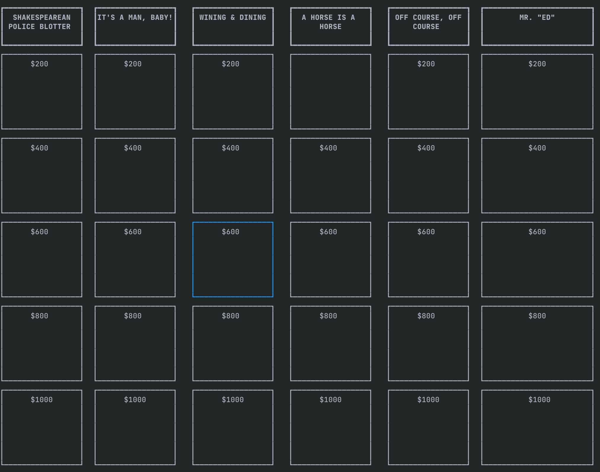

# Play jeopardy in your terminal!

This tool provides both a back-end for pulling jeopardy games from j-archive and a front-end to play jeopardy in your terminal!

## How to play in your terminal
- `cargo run --bin console` will bring up the TUI.
- Enter a game id, and the jeopardy game will be loaded from j-archive.
- Use arrow keys to move your selection, enter to choose, and space to move on to the next round.
- Use 'q' to quit
- Have fun!

J-archive game id: 1234

## TODO
- final jeopardy
- allow serializing/deserializing jeopardy games as JSON
- scorekeeping and support for multiple players
- mouse-based question selection
- daily double support
